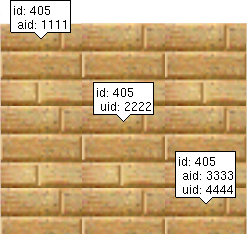
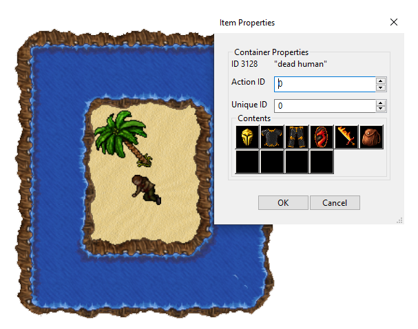
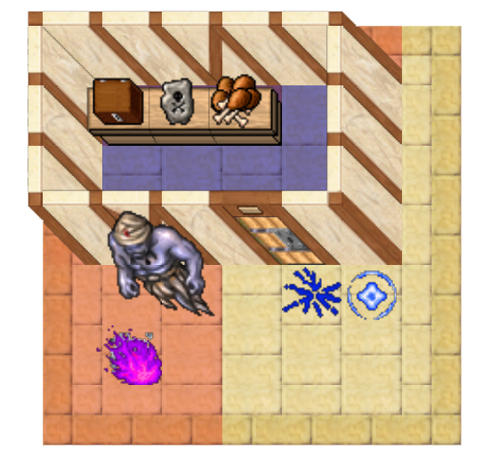

# Examples
There are multiple examples provided to show otbmgenerator works.

## OTBM to JSON parser
- **Example_1:** Simple tiles with no items over them. Three tiles have defined an *Action id* and *Unique id*.

  

- **Example_2:** Multiple tiles with a corpse containing several items within.

  

- **Example_3:** More complex example with a depot, house tiles, items with charges and a teleport.

  

  

